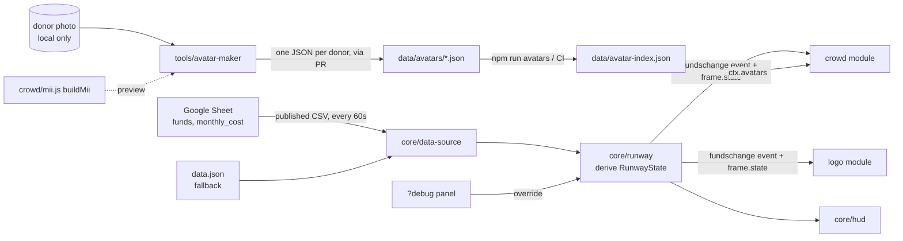

# Architecture

## Goals

1. **Four people build in parallel without merge conflicts.** Each workstream owns separate paths, and the only coupling is a small, explicit contract.
2. **Free and boring infra.** A static site on GitHub Pages, no backend and no bundler.
3. **One broken module never breaks the page.** Core isolates module failures.

## Data flow

## Runtime

`index.html` loads `src/core/app.js`, which:

1. Creates the **stage** (renderer, camera, lights, ground), which core owns.
2. Loads the first **RunwayState** and the **avatar index** in parallel.
3. For each name in `src/modules.js`, creates a `THREE.Group` (`ctx.root`) and calls the default export of `src/<name>/index.js` with the `ModuleContext`. If a module throws, core logs it and skips it.
4. Replays the initial `fundschange` event so every module starts in sync.
5. Each frame, calls `instance.update({ dt, time, state })`. If a module throws there, core disables it and the page keeps running.

### RunwayState

| Field | Meaning |
|---|---|
| `funds`, `monthlyCost` | Euros, from the sheet |
| `runwayMonths` | `funds / monthlyCost` |
| `health` | `0..1`, reaching 1 at `config.healthyMonths` |
| `mood` | `panic` < 2 mo ≤ `worried` < 4 mo ≤ `calm` < 8 mo ≤ `thriving` (placeholder thresholds in `config.js`) |

Modules choose how to use it. **Continuous** visuals (how broken the logo is, how fast Miis walk) follow `frame.state`. **One-off** reactions (a shatter burst on a loss, a repair flourish on a donation) listen to the `fundschange` event and its `delta`.

### World layout

The shared constants live in `src/contracts/module.js`. Units are roughly metres, y is up and the ground is y = 0.
- Logo: centred at `(0, 2.5, 0)`, within a radius of 2.5.
- Crowd: on the ground, in the ring between radius 3.5 and 11.
- Core owns the camera, which looks at `(0, 1.8, 0)` from about 18 units away.

## Why these choices

| Decision | Alternatives considered | Why |
|---|---|---|
| Plugin modules plus contracts | One shared scene file | Four people in one file means constant conflicts |
| One JSON file per donor, index generated in CI | One big `avatars.json` | Parallel avatar PRs never touch the same file |
| Parametric Mii spec | Photo textures on faces | Privacy, a tiny payload, and a consistent Mii look |
| No bundler, import map | Vite | Nothing to install for artists and designers. Revisit if we need npm packages that don't ship ESM |
| Google Sheet CSV | Excel Online, a database | Free, CORS-enabled, and treasurers already use spreadsheets |
| Error isolation in core | Trusting every module | Merging a half-finished module can't take the site down |

## Open decisions (core)

- The real `healthyMonths` and mood thresholds.
- The sheet's owner and who updates the numbers.
- Whether donations should appear as events, such as a new Mii walking in when a donor is added.
