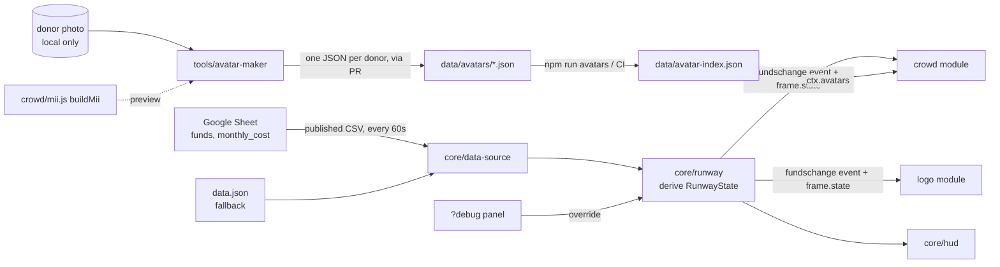

# Architecture

## Goals

1. **Four people build in parallel without merge conflicts.** Each workstream owns separate paths, and the only coupling is a small, explicit contract.
2. **Free and boring infra.** A static site on GitHub Pages, no backend and no bundler.
3. **One broken module never breaks the page.** Core isolates module failures.

## Data flow



## Runtime

`index.html` loads `src/core/app.js`, which:

1. Creates the **stage** (renderer, camera, lights, ground), which core owns.
2. Loads the first **RunwayState** and the **avatar index** in parallel.
3. For each name in `src/modules.js`, creates a `THREE.Group` (`ctx.root`) and calls the default export of `src/<name>/index.js` with the `ModuleContext`. If a module throws, core logs it and skips it.
4. Replays the initial `fundschange` event so every module starts in sync.
5. Each frame, calls `instance.update({ dt, time, state, feelings })`. If a module throws there, core disables it and the page keeps running.

### RunwayState

| Field | Meaning |
|---|---|
| `funds`, `monthlyCost` | Euros, from the sheet |
| `runwayMonths` | `funds / monthlyCost` |
| `stress` | `0..1` from an S-curve of the runway (below) |
| `health` | `1 − stress` |
| `mood` | Bucketed stress: `thriving` < 0.1 ≤ `calm` < 0.35 ≤ `worried` < 0.7 ≤ `panic` |

### Money → feelings

All the maths lives in `src/core/feelings.js` (tested) and is tuned in `config.js` or live in the Simulate panel:

```
stress   s = 1 / (1 + e^((R − midMonths) / width))     R = runway months; midMonths 3, width 1.2
months   Δm = Δfunds / monthlyCost                        "months of runway bought or lost"
impulse  e = sign(Δm) · min(1, log2(1 + |Δm|))            €7,208 donation today = +1 month = full reaction
```

| Runway | 0.5 | 1 | 2 | 3 | 4 | 6 | 9 | 12 |
|---|---|---|---|---|---|---|---|---|
| Stress | 0.89 | 0.84 | 0.70 | 0.50 | 0.30 | 0.08 | 0.01 | 0.00 |

Each frame modules get **`frame.feelings`**: `stress` eases towards `state.stress` over ~3 s so sheet updates never snap, and `emotion` (−1..1) is kicked by every impulse and fades over ~8 s. **Continuous** visuals follow `frame.feelings`. **One-off** reactions listen to the `fundschange` event and its `impulse` (0 at startup and for quiet simulation slides).

- **Stage (core):** the sun sets as stress rises (elevation 65° → 8°, warmer and dimmer) and the CSS sky slides from day to dusk.
- **Crowd:** see `src/crowd/mood.js`. Each Mii has a personal threshold (worriers vs. chill ones) and catches stress from neighbours (contagion), which drives activity weights (snacks and dancing ↔ running and flailing), tempo, speed, hangouts vs. scattering, and worried brows. Impulses ripple out from the centre as cheers or flinches; a big donation (impulse ≥ 0.8) plays the "Gather & dance" group emote.

### Simulate

A 🎛 **Simulate** button sits bottom-left on every page, including the live site; `?debug` opens it right away. It drives `runway.override()`, the same path real sheet updates take: runway slider, donate €200 / 1 month / 3 months, lose 1 month, crash, a 40-second story mode, the stress-curve knobs, and each module's own folder. "Back to live data" returns to the sheet.

### World layout

The shared constants live in `src/contracts/module.js`. Units are roughly metres, y is up and the ground is y = 0.
- Logo: centred at `(0, 2.5, 0)`, within a radius of 2.5.
- Crowd: on the ground, in the ring between radius 3.5 and 11.
- Core owns the camera, which looks at `(0, 1.8, 0)` from about 18 units away.

## Why these choices

| Decision | Alternatives considered | Why |
|---|---|---|
| Plugin modules plus contracts | One shared scene file | Four people in one file means constant conflicts |
| One JSON file per donor, index generated in CI | One big `avatars.json` | Parallel avatar PRs never touch the same file |
| Parametric Mii spec | Photo textures on faces | Privacy, a tiny payload, and a consistent Mii look |
| No bundler, import map | Vite | Nothing to install for artists and designers. Revisit if we need npm packages that don't ship ESM |
| Google Sheet CSV | Excel Online, a database | Free, CORS-enabled, and treasurers already use spreadsheets |
| Error isolation in core | Trusting every module | Merging a half-finished module can't take the site down |

## Open decisions (core)

- The real stress curve: `stress.midMonths` (the "sweat point") and `width`.
- The sheet's owner and who updates the numbers.
- Whether donations should appear as events, such as a new Mii walking in when a donor is added.

## Garden navigation and group-emote extension

Core supplies optional `ctx.navigation` via `src/core/navigation.js`: `register(owner, polygons)` returns an unregister function; `isWalkable`, `segmentClear`, and `findPath` let modules use the shared ground without importing each other's internals. The center garden registers actual bed and furniture contours before crowd loads. `GARDEN_RADIUS` describes the larger ground-level centerpiece; the legacy logo constants remain for compatibility. Reachable paths between beds are open to normal crowd movement.

The crowd's optional `instance.groupEmotes` API provides named sequences with formation/motion/release phases, queue/replace/cancel controls, and lifecycle/cue subscriptions. Core can attach future occasion triggers through this API. No triggers or confetti are currently installed. Details: [group-emote guide](../src/crowd/group-emotes/README.md).
